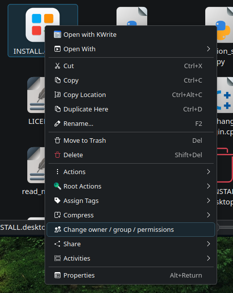
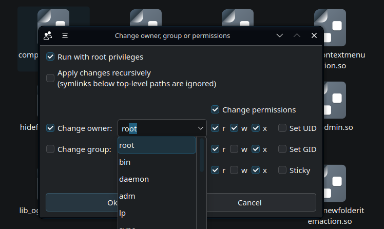

# OGP Changer

A **Qt 6** application for **KDE Plasma 6** that allows changing ownership and permissions of selected filesystem objects. It integrates directly with **Dolphin** via the context menu.
It uses **cogp** utility (separate repository: https://github.com/andrzejs-gh/cogp) which is also provided in /src.

## Privilege escalation

Privilege escalation is done via **pkexec** when "Run with root privileges" is selected.

## Applying changes recursively

When "Apply changes recursively" is selected, changes are applied to all selected folders recursively. Symlinks below top level items are ignored, they're not followed and no changes are applied to them.

## Installation and uninstallation

To install **OGP Changer** launch INSTALL.desktop. Uninstallation is done by launching UNINSTALL.desktop. Both are handled by Python scripts located in /scripts. 

Installation scripts build and install the following binaries:
- cogp (installed in `~/.local/bin`)
- ogp_changer (installed in `~/.local/bin`)
- ogp_changer_fileitemaction.so (installed in `...Qt 6 plugin dir.../kf6/kfileitemaction`)

Uninstallation completely removes them.

To install or remove the plugin in `...Qt 6 plugin dir.../kf6/kfileitemaction`, root privileges are required. The user will be asked for them and offered an alternative to manually move/remove the .so with the exact paths and directories provided.

## Requirements

### Runtime requirements
- **KDE Plasma 6**
- **Dolphin**
- **pkexec** (for privilege escalation)

### Build requirements
- **CMake ≥ 3.16**
- **C++17-compatible compiler**
- **Qt 6 dev**
- **KDE Frameworks 6 dev**
  - CoreAddons
  - KIO

If any dependencies are missing, the installation script notifies the user and provides instructions on how to install them.
  
## Screenshots

Context menu:

Dialog:

